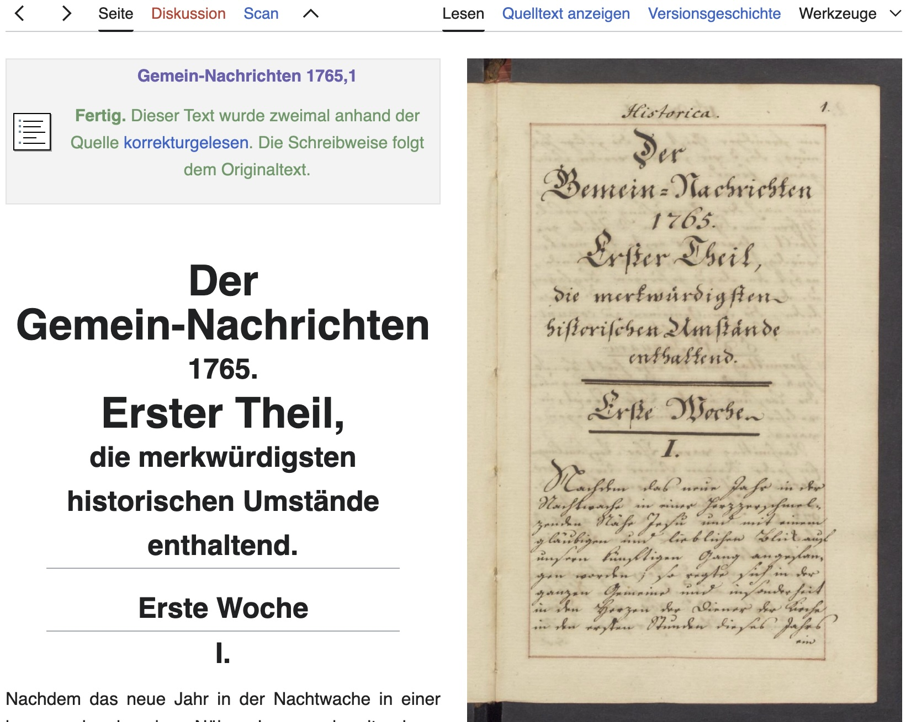

layout: true
  

  <table>
    <tr>
      <td style="text-align:right">Sächsische Landesbibliothek – Staats- und Universitätsbibliothek</td>
      <td>25. April 2025</td>
      <td style="text-align:right"><a href="https://www.slub-dresden.de/">www.slub-dresden.de</a></td>
    </tr>
    <tr>
      <td style="text-align:right">Referat 4.3</td>
      <td />
    </tr>
  </table>

  <table>
    <tr>
      <td style="text-align:left"><b>Kay-Michael Würzner</b></td>
    </tr>
    <tr>
      <td style="text-align:left">Referat 4.3</td>
    </tr>
    <tr>
      <td style="font-size:8pt"><b>25. April 2025</b></td>
    </tr>
    <tr>
      <td style="font-size:8pt">Seminar Datenkompetenz</td>
    </tr>
  </table>

---

class: title-slide
count: false

# Wikisource
## Hands-on-Seminar

---

class: part-slide
count: false

# Einstieg

---

# ⏱ Überblick

| Abschnitt               | Inhalt                                                      | Dauer  |
|------------------------|-------------------------------------------------------------|--------|
| **1. Einstieg**        | Wikisource im Wikimedia-Kosmos, Ziel des Workshops          | 10 min |
| **2. Einführung**      | Was ist Wikisource? Warum ist es relevant für DH?           | 10 min |
| **3. Praxisblock I**   | Scans auf Commons hochladen, Index- und Werkseite anlegen   | 25 min |
| **4. Praxisblock II**  | OCR durchführen, erste manuelle Korrekturen                 | 25 min |
| **5. Austausch & Fragen** | Erfahrungen, Stolpersteine, Q&A                        | 10 min |
| **6. Ausblick**        | Nächste Schritte, Annotation, Wikidata                      | 5 min  |

---

class: split

# 🧠 Lernziele

.pull-left[
- Wikisource als Plattform für kollaborative Editionsarbeit **kennenlernen**
- Eigene Digitalisate auf Commons & Wikisource **integrieren**
- OCR-basierte Transkription **starten** & erste Korrekturen **durchführen**
- Editionsprozesse im digitalen Raum praktisch **nachvollziehen**
]

.pull-right[

]

---

class: part-slide
count: false

# Einführung

---

class: split

# 🧩 Wikisource im Wikimedia-Universum

.pull-left[

- Teil des Wikimedia-Projektnetzwerks
- Schwesterprojekte: Wikipedia, Wikidata, Commons, Wikibooks etc.
- Fokus von Wikisource:
  - **Digitale Quellenbibliothek**
  - Transkription historischer Texte
  - Zugänglich & überprüfbar für alle
- **Wichtig:** Freiwilligenprojekt mit strengen Editionsstandards!
]

.pull-right[

]

---

class: split

# 📖 Was macht Wikisource besonders?

.pull-left[
- Text-Bild-Ansicht  
- Bearbeitungsschritte **nachvollziehbar und versioniert**  
- **präzise Editionsarbeit** in einem kollaborativen Umfeld  
- **keine Spezialsoftware** – nur mit Browser und Account  
]

.pull-right[

]

- Inhalte **sofort öffentlich zugänglich** und nachnutzbar
- Kein abgeschlossenes Editionsprodukt, sondern ein **offener, transparenter Prozess**

---

class: split

# 🧠 Warum Wikisource für die DH?

.pull-left[
- **Digitale Quellenarbeit**: Transkription historischer Texte
- **Quelle für Korpuszusammenstellung**: Texte frei verfüg- und nachnutzbar
- **Verknüpfbar mit Wikidata**: Strukturierte Metadaten
]

.pull-right[

]

- **Offene APIs**: Daten für Forschung & Visualisierung
- **Praxisnah & nachhaltig**: Inhalte dauerhaft professionell gehostet

---

# Navigation und Überblick

- **Die Hauptseite**: Aktuelle Projekte, Neuigkeiten, Links zu Anleitungen
- **Kategorien**: Systematische Ordnung der Texte nach [Thema](https://de.wikisource.org/wiki/Kategorie:Philosophie), Autor, Sprache etc.
- **Portale**: Thematische Zugänge zu spezifischen Inhaltsbereichen (z.B. [Portal:Literatur](https://de.wikisource.org/wiki/Literatur)).
- **Suchfunktion**: Gezieltes [Finden](https://de.wikisource.org/w/index.php?fulltext=1&search=Herrnhut&title=Spezial:Suche&ns0=1&ns102=1&ns104=1) von Texten und Seiten.
- **Anleitungen**: Schnelleinstieg zum Mitmachen
  
---

# Werke

---

# Editionsrichtlinien

- **Originalgetreue Wiedergabe**: So nah wie möglich am Original bleiben.
- **Umgang mit Orthographie**: In der Regel die Originalschreibweise beibehalten.
- **Zeilenumbrüche**: Können übernommen werden, sind aber nicht immer zwingend.
- **Fehler im Original**: In der Regel nicht korrigieren, aber ggf. in Anmerkungen festhalten.
- **Auszeichnungen**: Verwendung von einfachen Auszeichnungen für Hervorhebungen (kursiv, fett).

[Zu den Richtlinien](https://de.wikisource.org/wiki/Wikisource:Editionsrichtlinien)

---

class: part-slide
count: false

# Praxisblock

---

# Vorbereitung des Materials für den Upload

- Gemeinfreiheit prüfen!
- Geeignete Dokumente: Kurze, gut lesbare Texte für den Einstieg.
- Scannen: Wenn kein digitales Original vorhanden ist:
    + Auf gute Qualität achten (ausreichende Auflösung, keine Verzerrungen).
    + Als TIFF oder PDF speichern (ggf. als DjVu für mehrseitige Dokumente).
- Benutzerkonto erstellen

---

class:split

# Der Upload-Prozess

.pull-left[
- via [Wikimedia Commons](https://commons.wikimedia.org/wiki/Special:UploadWizard?uselang=de)
    + zentrales Medienrepositorium für Wikiversum
    + Bilder, Audio, Video ...
    + definierte Nutzungsrechte = rechtssichere Nutzung  
- Datei auswählen und beschreiben
    + Urheber, Erscheinungsdatum
    + Quelle
    + Lizenz
- Dateinamen merken
]

.pull-right[

]

---

# Indexseite anlegen

1. PDF auf Wikimedia Commons hochladen
2. Auf Wikisource aufrufen:
   `https://de.wikisource.org/wiki/Index:MeinWerk.pdf`
3. Formular ausfüllen:
    - **Bild**: Dateiname auf Commons (z. B. `[[File:Brief aus Brüssel.pdf|page=3|thumb]]`)
    - **Autor**: (optional) Verfasser
    - **Titel**: Werktitel
    - **Seiten**: Relevante Scans (z. B. `<pagelist from=3 to=10 3=1 />`)
    - **Bearbeitungsstand**: Unkorrigiert
    - **Kategorien**: Textpatenschaften DH 2025
4. Speichern ✔️

> Ergebnis: Seitenübersicht wird automatisch erzeugt!

---

# 📚 Werkseite anlegen

1. Neue Seite erstellen, z. B.:
   `https://de.wikisource.org/wiki/Mein_Werk`
2. Inhalt einfügen:
    - Vorlage `Textdaten`
    - Metadaten erneut eingeben
    - jede Menge Tweaks vorhanden, Orientierung an *Leuchttürmen*
    - Später: korrigierte Seiten ergänzen
  
- auch für Autoren mgl. (vgl. [Schiller](https://de.wikisource.org/wiki/Friedrich_Schiller))
    + Vorlage `Personendaten` 
  
---

#  🛠️ Einzelne Seiten bearbeiten

1. In der Index-Seite auf eine Seitenzahl klicken
2. Auf der Seite (z. B. `Seite:MeinWerk.pdf/9`):
   - „Bearbeiten“ klicken ✏️
   - „OCR“-Knopf drücken, Modelle wählen, transkribieren
3. Text korrigieren:
   - Rechtschreibung prüfen
   - Originaltreue beachten
4. Korrekturstatus setzen:
   - 🔴 Unkorrigiert
   - 🟡 Korrigiert
   - 🟢 Geprüft
5. Speichern ✔️

> Seite für Seite entsteht der neue, transkribierte Text!

---

class: split

# Bearbeitungsoberfläche

.pull-left[
- Textbereich
- Werkzeugleiste (fett, kursiv, Überschriften, etc.)
- Spezialzeichen-Auswahl
- **Vorschau-Button**
- Zusammenfassungsfeld
- Änderungen speichern
]

.pull-right[
- grundlegende Formatierung
    + Fett und Kursiv: Verwendung von `'''fett'''` und `''kursiv''`
    + Überschriften: Verwendung von `== Überschrift 1 ==`, `=== Überschrift 2 ===` etc.
    + Zeilenumbrüche (manuell): ` ` (sparsam verwenden!)
    + Listen: Verwendung von `*` für unsortierte und `#` für sortierte Listen
]

---

# Korrekturstrategien

- **OCR mehrfach durchführen:** Unterschiedliche Engines und Modelle
- **Seite-für-Seite-Vergleich:** Scan und OCR-Text nebeneinander betrachten.
- **Sorgfältiges Lesen:** Langsam und konzentriert lesen.
- **Auf typische OCR-Fehler achten:** z.B. Verwechslung ähnlicher Buchstaben (i/l, o/0, c/e).
- **Umgang mit Sonderzeichen:** Nutzung der Spezialzeichen-Auswahl unter dem Editierfenster.
- **Unsicherheiten kennzeichnen:** Wenn ein Zeichen nicht eindeutig lesbar ist (z.B. mit `{{fraglich|?}}`).

---

class: split

# Diskussionsseiten nutzen

Jede Seite auf Wikisource hat eine zugehörige Diskussionsseite.

.pull-left[
Anwendungsbeispiele:
- Fragen zu unklaren Textstellen
- Diskussion über die korrekte Transkription
- Hinweise auf Fehler oder Verbesserungsvorschläge
- kollaborative Klärung schwieriger Passagen
- lebhafte Community in Dresden (insb. [Wikisource-Sprechstunde in der SLUB](https://de.wikisource.org/wiki/Wikisource:Wikisource-Informationsstand_SLUB))
]

.pull-right[

]

---

class: split

# Eigennamen & Ortsnamen auszeichnen

.pull-left[
- einheitliche Darstellung
    + ggf. Editionsrichtlinien anpassen
- semantische, desambiguierte Anreicherung
- Verlinkung zu Personen-/Ortseinträgen
- Grundlage für DH-Auswertungen
]

.pull-right[

]

---

# 🛠️ Auszeichnungsformen

+ **🔗 Verlinkung auf Artikel**
    + `[[Goethe]]` → Link auf Artikel
    + `[[Johann Wolfgang von Goethe|Goethe]]` → benutzerdefinierte Anzeige
+ **🧠 Semantische Auszeichnung (ohne Link)**
    + `{{Person|Goethe}}` → typisierte, nicht klickbare Markierung
    + `{{Ort|Weimar}}` → typisierter Ortsname
+ **🧠 + 🔗 Kombination (Semantik + Link)**
    + `{{Person|[[Goethe]]}}` → typisiert & verlinkt
+ **📎 Fußnoten & Anmerkungen**
    + `Goethe<ref>Deutscher Dichter (1749–1832)</ref>` → Zusatzinfo
+ **🔗 Verlinkung zu Wikidata**
    + `[[:d:Q762|Goethe]]` → direkte Verlinkung zu Wikidata
    + `{{Person|[[:d:Q762|Goethe]]}}` → Wikidata-Link + semantische Typisierung

---

class: part-slide

# Vielen Dank für Ihre Aufmerksamkeit!

<a href="https://wrznr.github.io/dhm-dk-wikisource/">wrznr.github.io/dhm-dk-wikisource</a>

